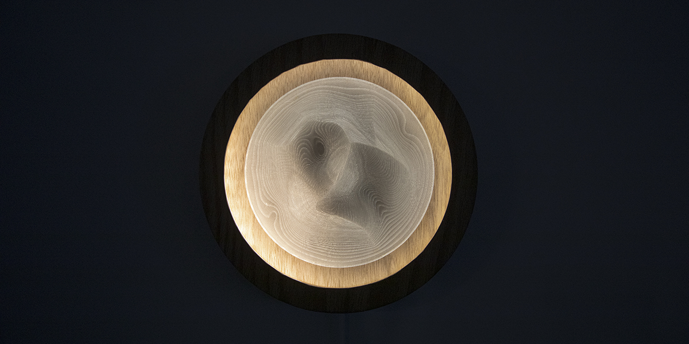
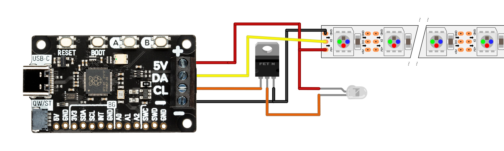

# Dune

Code in CircuitPython

> Dune is a lamp designed for massage waiting rooms. Inspired by the Japanese dry garden / zen garden, we hope to bring an experience of peace, meditation, and emptiness by praising the circular movements of shadows created through the miniature landscape lightened by dynamic LEDs to help patients breathe and relax.

## Circuit

## Materials

| Description                                                                      | Quantity |
| -------------------------------------------------------------------------------- | -------- |
| Female Threaded Round Standoff, Aluminum, 1/8" Od, 1/4" Long, 2-56 Thread Size   | 4        |
| Passivated 18-8 Stainless Steel Pan Head Phillips Screw, 2-56 Thread, 3/4" Long  | 1        |
| Pimoroni Plasma 2040: controller for WS2812/Neopixel addressable LED strip       | 1        |
| Adafruit Mini Skinny NeoPixel LED Strip - Warm White 3000K - 60 LEDs/m - 1m long | 1        |
| MOSFET N-CH 100V 14A TO220AB                                                     | 1        |
| COB 640LEDs 1200lm Dimmable 5V USB LED Strip White 4000K                         | 1        |
| Raspberry Pi 4 Power Supply USB-C 5.1V 3A                                        | 1        |
| 1 in. x 12 in. x Random Length S4S Oak Board                                     | 2        |
| 3 mm (1/8) x 12 x 12 Craft Plywood                                               | 1        |
| Cricut® Walnut Natural Wood Veneer                                               | 1        |
| Flexible Translucent PE Plastic Sheet 48x24x1/30 (0.03)                          | 1        |
| Clear Colorless Acrylic Sheet 12'' x 12'' x 1/16'' Thickness                     | 1        |
